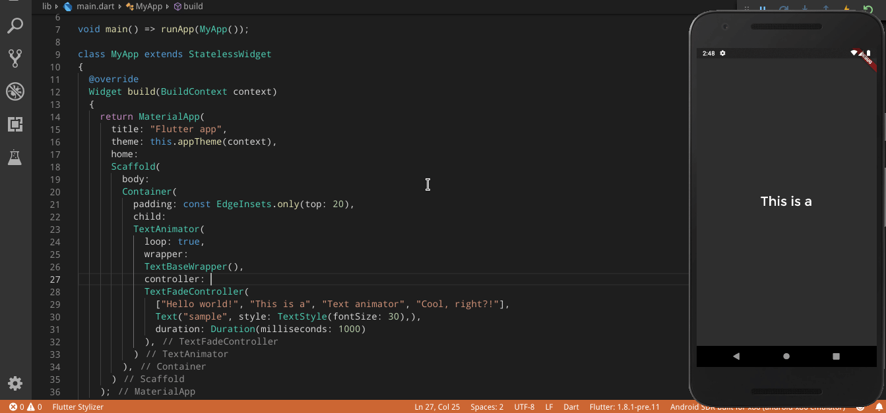
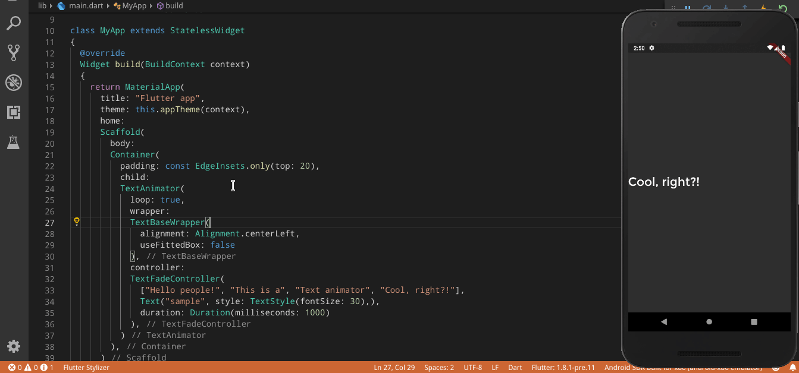
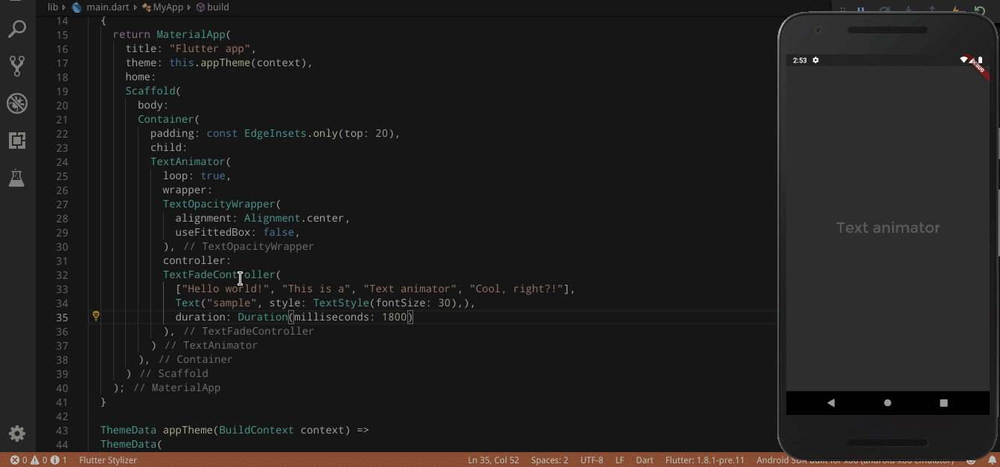
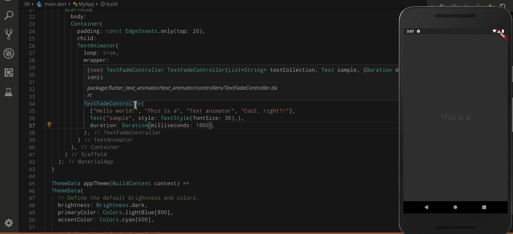

# Flutter Text Animator

A customizable text animator

## Getting Started
Copy the folder "lib/text_animator" to your project and use it as shown in the description below :)

### Regular Animation

### Opacity Animation

### Gradient Animation

### Typer Animation

## Copyright
Use this tool however you like, just aknowledge that i developed it :).
